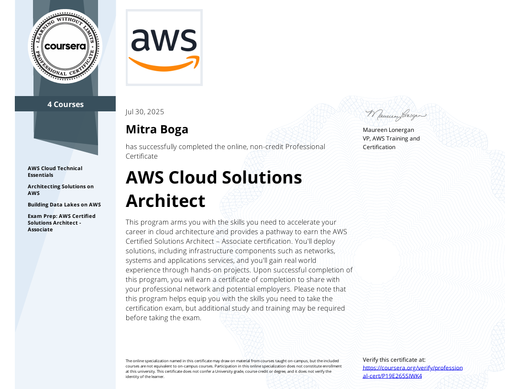
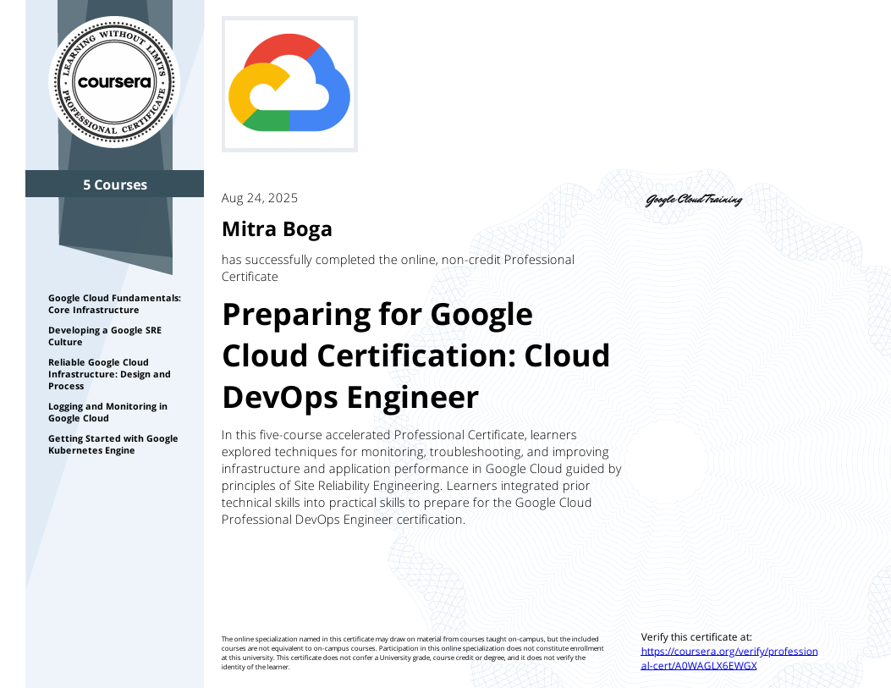

<!--
  Hi there 👋 I’m Mitra Boga.
  Feel free to get inspired by this README.
  But DO NOT Copy!!!
-->

  
  
---
  
  <!-- ✅ Dynamic terminal image -->
  

    
  

---

## 🧑🏽‍💻 Projects are pinned below 📌
- These projects encompass my learning, curiosity, and love for software, engineering and business! (visit repositories for more!)

---

## 🎓 Education

- **Gandhi Institute of Technology and Management — B.Tech (CSE)**
  - Major: Computer Science Engineering
  - Minor: Mechanical Engineering

- **University of Waterloo — AFM (Business Analysis)**
  - Accounting and Financial Management, Co-op

---

## 📈 CGPA
**8.2**

---

## 📜 Certifications

<!--
✅ INSTRUCTIONS:
1) Upload 6 certificate images into your repo (recommended folder: /assets/certs/)
2) Update the `img src` paths below to match your actual filenames
3) Keep the <a href> pointing to the full-size file so it opens on click
-->

<table>
  <tr>
    <td align="center">
      
    </td>
    <td align="center">
      
    </td>
    <td align="center">
      
    </td>
  </tr>
</table>

---

## 📩 Recommendation Letters
- [Professor Testimonials/Recommendation Letters](https://github.com/mitraboga/Recommendation_Letters/tree/main)

---

## 🦾 Technical Skills

