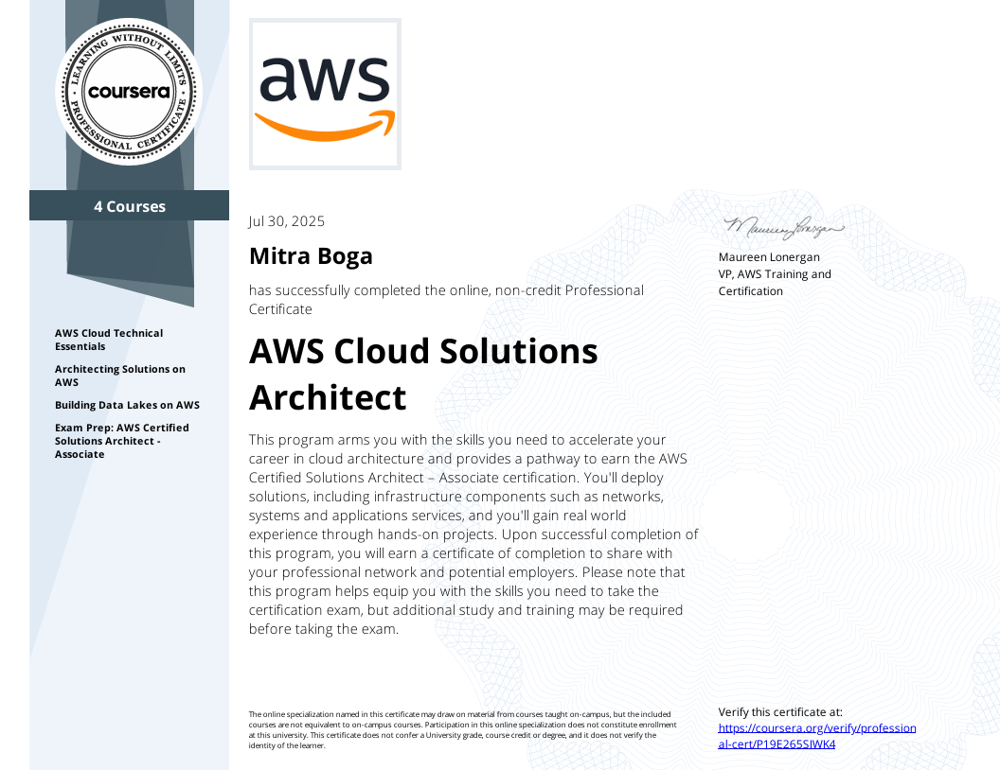
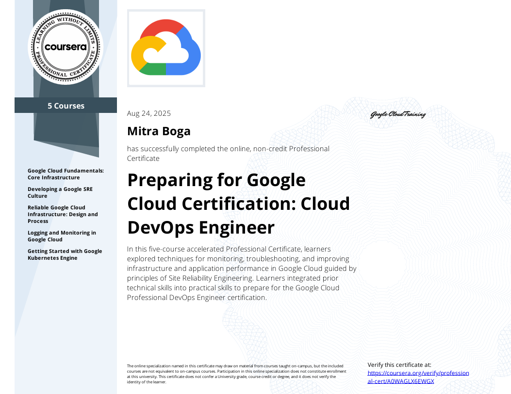

<!--
  Hi there 👋 I’m Mitra Boga.
  Feel free to get inspired by this README.
  But DO NOT Copy!!!

  As a token of appreciation, please do Follow me!
-->

  

    
    &nbsp;
    
  

   

  <!-- ✅ Dynamic terminal image (LINK: https://mitraboga.github.io/terminal-gif-maker/) -->
  

    
  

---

## 🎖️ Matrix Tutoring Academy

### Building the Next Generation of AI-Native Engineers. Stay Ahead of the Curve. ➡️<a href="https://mitraboga.github.io/MatrixTutoringAcademy/" target="_blank">Click Here to Join.</a> 

Learn: `Computer Science Foundations` • `Programming` • `Web Development` • `Cloud Computing` • `Networks` • `AI-Native Building`

---

## 🎓 Education

- **Gandhi Institute of Technology and Management — B.Tech (CSE)**
  - Major: Computer Science Engineering | Minor: Mechanical Engineering

- **University of Waterloo — AFM**
  - Accounting and Financial Management, Co-op | Spl. Business Analytics

---

<table width="100%">
  <tr>
    <td align="center" width="50%">
      
    </td>
    <td align="center" width="50%">
      
    </td>
  </tr>
</table>

---

<table width="100%">
  <tr>
    <td align="center" width="33%">
      
    </td>
    <td align="center" width="33%">
      
    </td>
    <td align="center" width="33%">
      
    </td>
  </tr>
</table>

---

## 🦾 Technical Skills

